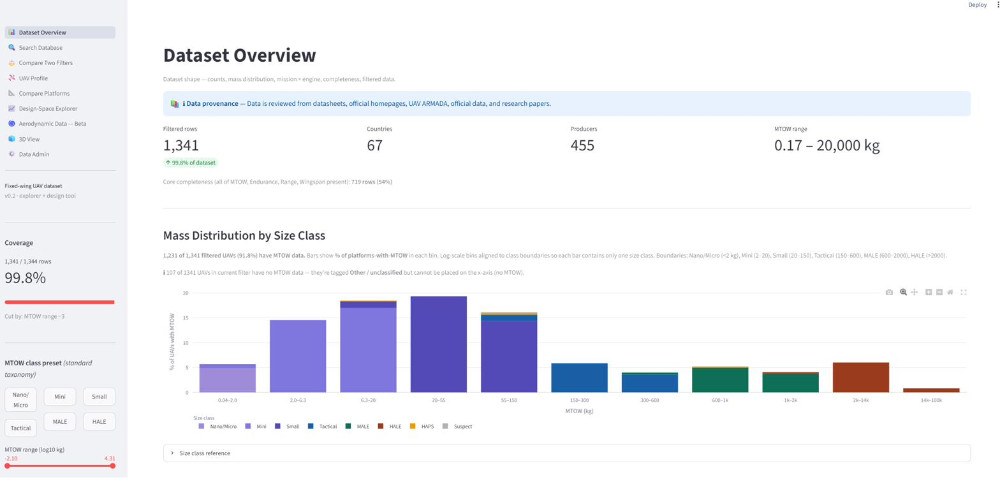
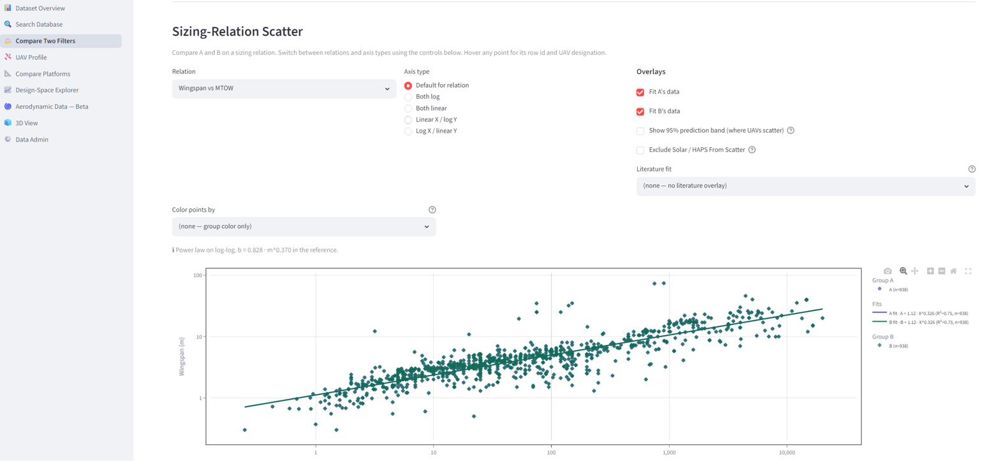
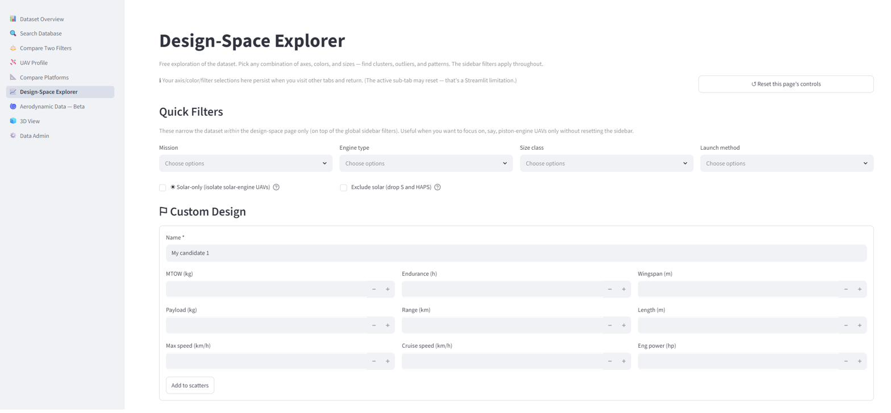
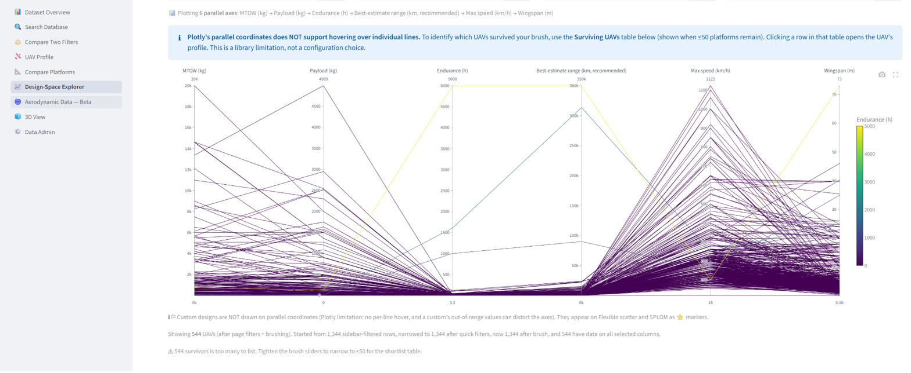

# Fixed-wing UAV Explorer — Limited Edition

**Version 1.0.0-limited** · **Code license:** [AGPL-3.0](LICENSE-CODE.md) · **Data license:** [CC BY-NC 4.0](LICENSE-DATA.md) · **Requires:** Python 3.10+

An interactive dashboard for exploring and comparing fixed-wing UAV characteristics across mass, geometry, performance, and mission attributes. This is the **public limited edition** intended for students, researchers, and design educators.

## What's in this limited edition

- **Dataset**: 710 fixed-wing UAVs (stratified sample of a larger curated database)
- **3 analytical tabs**:
  - **Dataset Overview** — shape of the data, completeness, distributions
  - **Compare Two Filters** — side-by-side comparison of two filtered subsets with sizing-relation scatter, literature overlays, prediction bands, and density heatmaps
  - **Design-Space Explorer** — place a candidate design in the data cloud across flexible scatter, scatter matrix, and parallel coordinates

## Quick start

Already have Python 3.10+? Clone and run:

```bash
git clone https://github.com/MoatasemMomtaz/uav-dashboard-limited.git
cd uav-dashboard-limited
python -m venv .venv
source .venv/bin/activate              # or .\.venv\Scripts\Activate.ps1 on Windows
pip install -r requirements.txt
streamlit run app.py
```

The app opens automatically in your browser at http://localhost:8501.

**New to Python?** See [INSTALL.md](INSTALL.md) for a complete from-scratch guide (Windows + Linux), including installing Python itself.

## Documentation

- **[INSTALL.md](INSTALL.md)** — install + run instructions, including Python install
- **[USER_GUIDE.md](USER_GUIDE.md)** — what each tab does, how to use the controls, what to read from each chart
- **[LICENSE-CODE.md](LICENSE-CODE.md)** — code license (AGPL-3.0)
- **[LICENSE-DATA.md](LICENSE-DATA.md)** — dataset license (CC BY-NC 4.0)
- **[COPYRIGHT.md](COPYRIGHT.md)** — copyright notice and what is/isn't protected
- **[CITATION.cff](CITATION.cff)** — how to cite this work

## Screenshots

**Dataset Overview**



**Sizing-Relation Scatter — Compare Two Filters**



**Design-Space Explorer**



**Parallel coordinates**



## License summary

This work uses a **dual license** model:

- **Code** is licensed under [AGPL-3.0](LICENSE-CODE.md). You may use, modify, and redistribute for non-commercial purposes. If you deploy a modified version as a network service, you must publish your modifications under the same license.
- **Dataset** is licensed under [CC BY-NC 4.0](LICENSE-DATA.md). Non-commercial use only; attribution required.
- **UI layout, visual design, and analytical structure** are protected by copyright — see [COPYRIGHT.md](COPYRIGHT.md).

**If you use this app, the dataset, or any derived analysis in a publication, thesis, or research report, you must cite this work.** See [CITATION.cff](CITATION.cff) for the recommended format.

## How to cite

```bibtex
@software{momtaz_2026_uav_explorer,
  author       = {Momtaz, Moatasem B},
  title        = {Fixed-wing UAV Explorer (Limited Edition)},
  version      = {1.0.0-limited},
  year         = {2026},
  license      = {AGPL-3.0},
  url          = {https://github.com/MoatasemMomtaz/uav-dashboard-limited}
}
```

GitHub will automatically render the citation widget from `CITATION.cff` (look for the "Cite this repository" button on the right side of the project page).

## Reporting issues

Found a bug or have a feature request? Open an issue at
https://github.com/MoatasemMomtaz/uav-dashboard-limited/issues

For inquiries about the full version (more rows, more tabs, additional features) or commercial-use questions, contact: **mbmomtaz@gmail.com**

## Acknowledgments

Built with [Streamlit](https://streamlit.io/), [Plotly](https://plotly.com/python/), [Pandas](https://pandas.pydata.org/), and [scikit-learn](https://scikit-learn.org/). The dataset draws on published sources including the work of J. L. Palmer (DSTO-TR-2952), Verstraete/Palmer/Hornung (2017), Gundlach (2012), and others — see references in `CITATION.cff`.

---

Copyright © 2026 Moatasem B Momtaz
