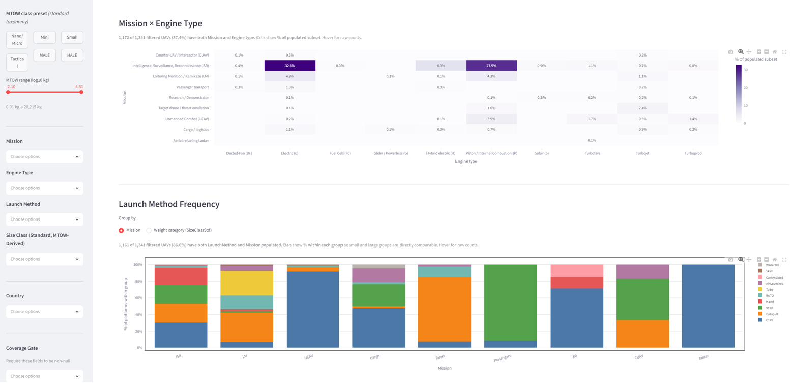
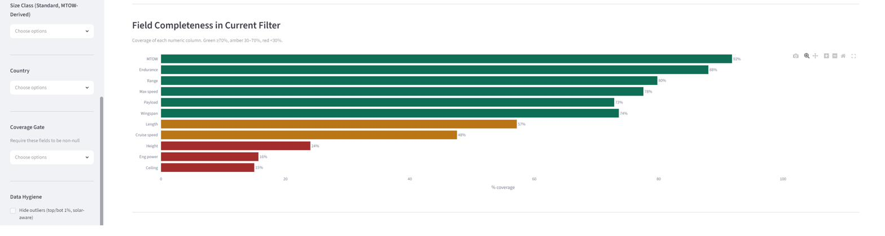
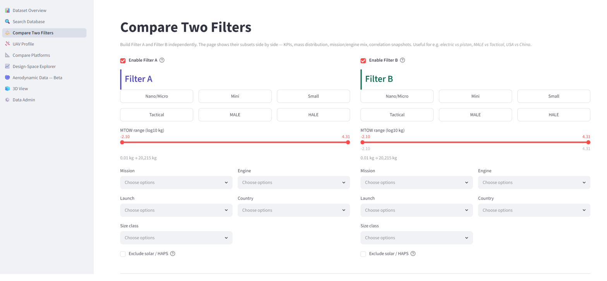
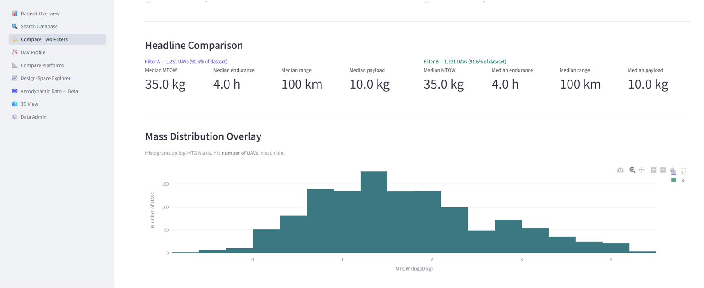
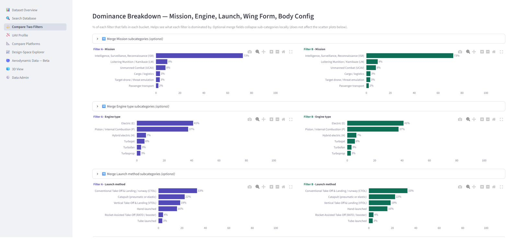
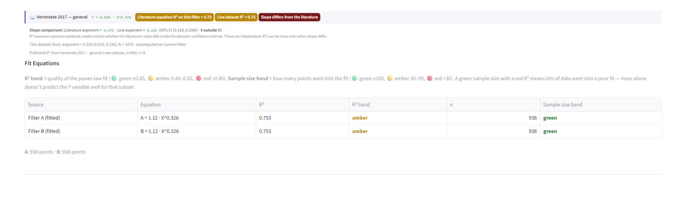
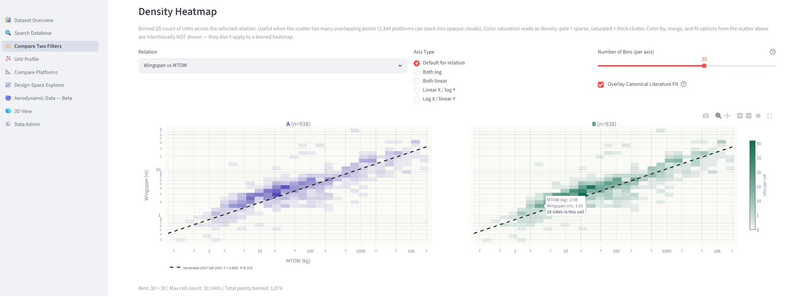
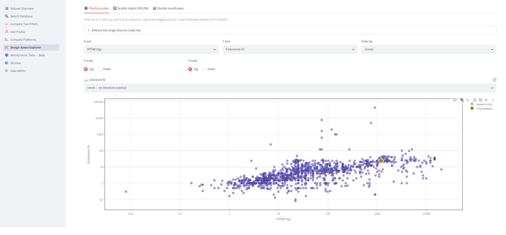
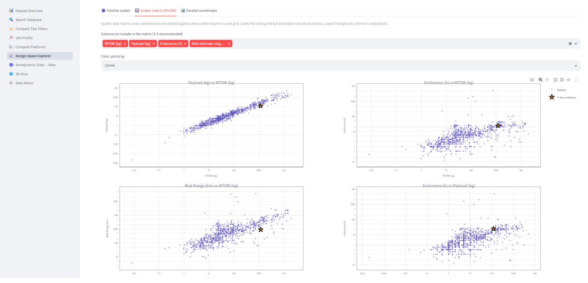
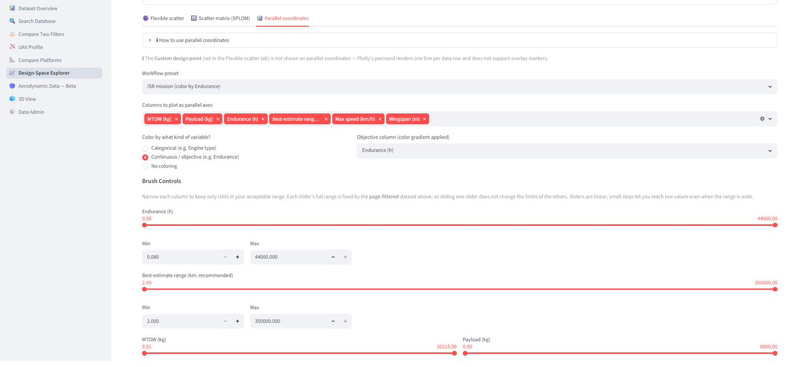

# User Guide

> **Honest disclaimer**: you don't really need to read this guide. The app is built to be poked at — most controls have tooltips (the small **?** icon), and the worst thing that happens if you click the wrong thing is that the chart looks weird. Try the app first. Come back here when something confuses you. Or read it linearly if you're the methodical type — that works too.

---

## User Guide

A walkthrough of the three tabs in the limited edition. Each tab is split into named sections; for each section we explain what it shows, the main controls, and what insight you can take away from it.

The aim of this guide is to be short and practical. It is **not** a complete reference — many controls have help tooltips (the small **?** icon) that explain detailed behavior. Use this guide to get oriented; use the tooltips for the corners.

---

## Tab 1 — Dataset Overview

**Purpose.** Show you the shape of the database before you analyze anything: how many UAVs, which countries and producers, what mass range, what fields are well-populated, what missions and engines dominate.

This tab is divided into the following sections:

1. **Header + Data provenance + License** — where the data came from, terms of use
2. **Coverage filters (sidebar)** — controls that narrow down the dataset for the Dataset Overview page
3. **Top-level KPIs** — number of UAVs, countries, producers, MTOW range
4. **Mass Distribution by Size Class** — how UAVs are distributed across mass bins
5. **Mission × Engine Type heatmap** — joint distribution of mission and propulsion
6. **Launch Method Frequency** — how UAVs are launched, grouped by mission or size
7. **Field Completeness** — which numeric fields are well-populated, which have gaps

### Section: Header + Provenance + License

The header states what the page does. The **Data provenance** banner tells you the data was reviewed from datasheets, official homepages, UAV ARMADA, official data sources, and research papers.

The **License & Terms** banner (just below provenance) summarizes the licensing in one line: Code AGPL-3.0, Dataset CC BY-NC 4.0, UI design © 2026 Moatasem B Momtaz. **Cite the work** if you use it in any publication (see `CITATION.cff`).

### Section: Coverage filters (sidebar)

The left sidebar has filters that apply to the **Dataset Overview page only** (the other two tabs build their filters inside the page itself):

- **MTOW Class Preset** (Nano/Micro, Mini, Small, Tactical, MALE, HALE, HAPS) — quick buttons to narrow the dataset to a size class
- **MTOW range (log10 kg)** slider — for finer mass-range control
- **Mission / Engine Type / Launch Method / Size Class / Country** — multi-select dropdowns
- **Coverage Gate** — require certain fields (e.g. MTOW, Endurance) to be non-null. Useful if you want to focus only on UAVs with complete records.

### Section: Top-level KPIs

After provenance/license, four big numbers tell you the current filter state:

- **Filtered rows** — how many UAVs match the sidebar filters
- **Countries** — how many countries are represented
- **Producers** — how many distinct manufacturers
- **MTOW range** — mass span of the filter

A small caption below shows **core completeness** — how many of the filtered UAVs have MTOW + Endurance + Range + Wingspan all populated. This tells you how usable the filter is for cross-attribute analysis.

### Section: Mass Distribution by Size Class

Bars show the **percent** of platforms-with-MTOW in each mass bin. Bins are log-scaled so the bar widths reflect equal mass ratios. Colors mark the size-class taxonomy boundaries (Nano/Micro, Mini, Small, Tactical, MALE, HALE).

**Value.** You can see at a glance whether your filter is dominated by small drones (peaked left) or large platforms (peaked right). If a single bar holds most of the mass, your downstream analysis will be biased toward that bin.

### Section: Mission × Engine Type heatmap

A grid showing the **percent of populated subset** in each (mission, engine) combination. Cells with darker color have higher representation.

**Value.** Quickly answers questions like: "Are ISR drones mostly electric?" (yes — top-left dark cells), "Do any large turbofan UAVs do cargo?" (probably yes, look at the cargo row in the turbofan column).

### Section: Launch Method Frequency

Stacked bars by mission (or by size class — toggle with the **Group by** radio). Each bar shows the % share of each launch method (CTOL, Catapult, VTOL, Hand, RATO, Tube, etc.) within that group.

**Value.** Reveals operational constraints. ISR drones come in many launch types; passenger UAVs are almost all CTOL. This is useful when scoping a design study.

### Section: Field Completeness

Horizontal bars showing what percent of filtered UAVs have a value for each numeric column. Green ≥70%, amber 30–70%, red <30%.

**Value.** Tells you which analyses are reliable on the current filter. If "Cruise speed" is amber (48% coverage), any analysis that requires cruise speed will throw away half your data — keep this in mind when you switch to Compare Two Filters.

---

## Tab 2 — Compare Two Filters

**Purpose.** Build two filtered subsets of the dataset (A and B) and compare them side by side. Useful for questions like "How does electric compare to piston?", "MALE vs Tactical?", "USA vs China?".

Filter A and Filter B are built **inside this page** (not from the sidebar). Each filter has its own panel with size-class buttons, MTOW slider, and category multi-selects.

This tab is divided into the following sections:

1. **Filter A and Filter B builders** — pick what each subset contains
2. **Headline Comparison** — side-by-side medians (MTOW, endurance, range, payload)
3. **Mass Distribution Overlay** — histograms of A and B on the same axis
4. **Dominance Breakdown** — what each filter is dominated by (mission, engine, launch, wing form, body config)
5. **Sizing-Relation Scatter** — the analytical core: fit a power law to each filter and compare against literature
6. **Density Heatmap** — binned 2D count, useful when scatter is too crowded

### Section: Filter A and Filter B builders

Each filter has identical controls: size-class buttons, MTOW range slider, Mission/Engine/Launch/Country/Size-class multi-selects, and an "Exclude solar / HAPS" toggle.

**How to use.** Enable just one filter (A) to compare it against the whole dataset, or enable both A and B for a head-to-head comparison. Common setups:

- A = piston engines, B = electric engines (engine comparison)
- A = ISR mission, B = LM mission (mission comparison)
- A = USA, B = China (country comparison)

The **Exclude solar / HAPS** toggle removes solar-powered UAVs and HAPS platforms from the comparison. These tend to be outliers (very large wingspan-to-mass ratios) that distort regression fits. Tick it when you want a clean apples-to-apples mass-vs-performance picture.

### Section: Headline Comparison

Four big numbers per filter: **median MTOW**, **median endurance**, **median range**, **median payload**. The header line shows how many UAVs each filter holds (e.g. "Filter A — 1,231 UAVs (91.6% of dataset)").

**Why medians, not means.** UAV characteristics are heavily skewed across orders of magnitude. The median is a robust center-of-mass that isn't pulled by extremes; the mean would be misleading.

**Note.** If a value is shown with a **≈** prefix, it means the value was *estimated* (e.g. cruise speed was derived from max speed × engine-class ratio because cruise wasn't published).

### Section: Mass Distribution Overlay

Histograms of both filters on a log-MTOW axis. The Y axis is the number of UAVs in each bin.

**Value.** Shows whether A and B occupy the same mass regime or different ones. If their peaks are far apart, you should be careful comparing performance metrics — different mass classes have intrinsically different performance.

### Section: Dominance Breakdown

For each filter, a row of horizontal bars showing what % falls in each category for: Mission, Engine type, Launch method, Wing form, Body config.

**Optional merge sub-categories.** Each panel has an expander labeled "Merge ... sub-categories (optional)". Inside, you can collapse fine-grained sub-categories into a single bucket (e.g. group all turbine variants together). This only affects the dominance bars; it does NOT change the scatter plot below.

**Value.** A common diagnostic. If filter A is 90% ISR-mission and filter B is 60% UCAV, then differences you see downstream might be driven by mission rather than the filter you intended.

### Section: Sizing-Relation Scatter — fitted curves, literature overlay, prediction band

The analytical workhorse. This is where you fit power laws to your data and compare against published correlations.

**Relation menu** — picks the X and Y axes. Example items:

- *Wingspan vs MTOW* — geometry vs mass
- *Endurance vs MTOW* — performance vs mass
- *Payload·Endurance vs MTOW* — combined figure of merit
- *Mission productivity (Cruise) vs MTOW* — Speed × Endurance × Payload, in km·kg

Many more are available; pick whatever pair you want to study.

**Axis type** — choose Both log, Both linear, or mixed. The "Default for relation" setting picks the most informative for the relation (usually both log on engineering data).

**Overlays panel:**

- **Fit A's data / Fit B's data** — when enabled (and the corresponding filter is enabled), a power-law regression is fitted to that subset and drawn as a solid line. The R² and N are shown in the legend.
- **Show 95% prediction band (where UAVs scatter)** — when enabled, a translucent band wraps a *pooled* fit of the visible evidence (A + B together, or whichever is enabled). The band shows where **individual UAVs** are likely to fall — width is proportional to residual scatter (wide for messy data with low R², tight for clean data with high R²). The band's center fit is added to the Fit Equations table as a separate row labeled *A + B combined (95% band center)* — except when it would exactly match an existing row.
- **Exclude solar / HAPS from scatter** — same effect as the toggle in the filter builders, but applies only to the scatter (not the headline numbers).

**Literature fit menu.** Drop-down listing published correlations applicable to the current relation. Examples:

- *Verstraete 2017 — general* — power law from the Verstraete/Palmer/Hornung 2017 paper
- *Verstraete 2017 — piston engines* — same paper, engine-specific variant
- *Palmer 2014 — manned envelope (boundary)* — upper/lower envelope curves (rendered as a band)

When you pick a literature fit, a colored dashed line appears on the scatter, plus a **comparison badge** appears below the scatter — see the next paragraph.

**Color points by.** When set to a category (e.g. EngineType), points are colored by that category. This **activates** the "Merge subcategories" controls below — they're disabled when color-by is "none".

**Merge subcategories.** Once color-by is active, you can:

- Map any subcategory to a different label (e.g. group all turbine variants under one bucket)
- Restrict the scatter to "show only" certain subcategories (e.g. only piston)

This affects **what is plotted in the scatter** AND **what the live fit is computed on**. The fit-table row reflects exactly what you see.

**Live verdict line (just after the scatter).**

After the scatter, a colored badge tells you how the literature fit compares to your data:

- The literature equation (e.g. `Y = 0.828 · X^0.370`)
- **Literature equation R² on this filter** — how well the published equation fits your visible data
- **Live dataset R²** — how well your data's own best-fit power law fits the data
- **Verdict** — "Slope matches the literature" or "Slope differs from the literature"

**Important.** The verdict checks whether the literature's **slope (exponent)** falls inside the dataset's 95% confidence interval for its own slope. This is **NOT the same as comparing R² values**. R² and slope-equality are independent — two equations can produce close R² values with statistically-different slopes. The badge includes a "Slope comparison" line that shows both exponents side-by-side so you can see exactly why the verdict fired.

**Fit Equations table.** Below the badge, a small table lists:

- The fitted equation for each filter (A, B), or per category if "fit per category" is on
- R² and color band (green ≥0.85, amber 0.45–0.85, red <0.45)
- Sample size N and color band (green ≥100, amber 30–99, red <30)
- A row for the *A + B combined (95% band center)* fit when the prediction band is enabled (suppressed when it would exactly duplicate an existing row)

**Value of this section.** This is where you test whether published sizing relations apply to *your specific subset*. Maybe Verstraete's general fit is good on all UAVs but its slope is off for pure electric UAVs — this is exactly the kind of question the verdict + slope-comparison answers.

### Section: Density Heatmap

A binned 2D count of UAVs across the selected relation. Color saturation reads as density: pale = sparse, saturated = thick cluster.

**Why it exists.** The scatter plot above can become an opaque cloud when the dataset is dense. The heatmap shows where the *mass* of the data lives, even when individual points are buried.

**Controls:**

- **Relation + Axis Type** — same as the scatter above
- **Number of bins** — slider 10–40. Higher = finer resolution but noisier
- **Overlay Canonical Literature Fit** — adds the relation's default published correlation as a dashed line for context

Color-by, merge, and fit options from the scatter are intentionally NOT shown here — they don't apply to a binned heatmap (each cell already aggregates many points).

**Value.** Best for "where do most UAVs cluster on this relation?" rather than "what's the trend line?". Complementary to the scatter, not a replacement.

---

## Tab 3 — Design-Space Explorer

**Purpose.** Free exploration of the dataset across multiple axes. Place a candidate design ("my candidate") inside the data cloud and see where it sits relative to existing UAVs.

This tab has its own **Quick Filters** at the top — it does NOT use the sidebar.

This tab is divided into the following sections:

1. **Quick Filters** — narrow the dataset within this page only
2. **Custom Design** — enter your own candidate design (or several)
3. **Flexible scatter** — any X vs any Y, with optional color-by, literature overlay, and prediction band
4. **Scatter matrix (SPLOM)** — every selected column vs every other in a grid
5. **Parallel coordinates** — multi-axis plot for finding survivors that meet many criteria simultaneously

### Section: Quick Filters + Custom Design

**Quick Filters.** Multi-selects for Mission / Engine type / Size class / Launch method, plus toggles for Solar-only and Exclude solar/HAPS. These narrow the dataset **for this page only** (on top of nothing else — the sidebar isn't used here).

**Custom Design form.** Enter the parameters of a candidate UAV: name, MTOW, Endurance, Wingspan, Payload, Range, Length, Max speed, Cruise speed, Eng power. Empty fields are fine — only the filled ones will be plotted. Click **Add to scatters** to save the design.

**Managing multiple designs.** Once you've saved 1+ designs, a row of **🗑 chips** appears showing each saved design. Click any chip to remove that design from all charts. To add another design, expand the **➕ Add another custom design** section.

**Value.** This is the design-evaluation workflow: enter your candidate's spec, then visually check where it sits relative to existing platforms in the scatter / SPLOM views.

### Section: Flexible scatter

Pick any X axis and any Y axis from the dataset's numeric columns. The plot updates immediately.

**Controls:**

- **X axis / Y axis** — choose from MTOW, Endurance, Range, Wingspan, Payload, Cruise speed, and many more
- **Color by** — color points by a category (Engine type, Mission, etc.) or by a continuous variable (creates a gradient)
- **X scale / Y scale** — log or linear, independently per axis
- **Literature fit** — same dropdown as Compare Two Filters; overlays a published correlation if applicable to the chosen relation
- **Fit a power-law per category** (when color-by is a category) — fits Y = A·X^B per category, drawn as a dashed line per group
- **Show 95% prediction band (where UAVs scatter)** — same prediction band as in Compare Two Filters, but pooled over the visible Design Space evidence. Requires both X and Y to be on **log scale** (the power-law fit only works in log-log space); if not, a small caption tells you to switch.

**Custom designs appear as ⚐ markers** when their relevant columns are populated. The marker is sized and colored to be visually distinct from the dataset cloud.

**Value.** Quick exploration without committing to a specific named relation. Useful for sanity-checking your candidate or for finding unexpected correlations.

### Section: Scatter matrix (SPLOM)

Every selected column plotted against every other column in a grid. Only the lower triangle is shown (the upper triangle would be a mirror image).

**Controls:**

- **Columns to include** — choose 3–5 columns (more becomes hard to read)
- **Color points by** — same as Flexible scatter

**Value.** Shows the full correlation structure at once. If your candidate (⭐) lies outside the data cloud on multiple subplots simultaneously, that's a strong signal the design is unusual.

### Section: Parallel coordinates

*Controls panel:*

*Plot:*

A multi-axis plot where each UAV is drawn as a line traversing several parallel axes (each axis is one column). Useful when you want to find UAVs that meet **multiple criteria simultaneously**.

**Controls:**

- **Workflow preset** — preset combinations (e.g. "ISR mission (color by Endurance)") that pick columns and coloring for common workflows
- **Columns to plot as parallel axes** — typically 4–6 columns work best
- **Color by** — categorical, continuous, or none
- **Brush controls** — for each axis, drag the sliders to restrict the range. Lines that fall outside any brushed range are dimmed.

**Survivors caption.** Below the plot, a count tells you how many UAVs match your brushed ranges (e.g. "**Showing 544 UAVs**..."). When ≤50 survive, the limited edition tells you the count without showing the individual rows; the full version has a clickable survivors table.

**Custom designs are intentionally NOT drawn** on parallel coordinates — Plotly's parcoord doesn't support per-line hover, and a custom design's out-of-range values can distort the axes. Custom designs appear as ⚐ on Flexible scatter and SPLOM instead.

**Value.** Best for *narrowing*. Start with all UAVs, set bounds on Endurance ≥ 10h, MTOW ≤ 500 kg, Payload ≥ 20 kg, etc., and see which platforms survive. This is the closest the dashboard gets to a search.

---

## Tips for getting the most out of the app

1. **Start with the sidebar (Dataset Overview only).** Set your overall scope (Mass class, mission, country) on the Overview page. Compare Two Filters and Design Space build their own filters separately.
2. **Check completeness first.** Look at the Field Completeness section in Dataset Overview. If your chosen Y axis is amber/red, your analysis will be on a small subset.
3. **Toggle log/linear.** Engineering data spanning many orders of magnitude is almost always more informative on log axes.
4. **Compare against literature, but watch the slope.** A high R² doesn't mean the literature equation matches your data — read the verdict + slope comparison carefully.
5. **Use the prediction band, not just R².** A high R² with a wide prediction band (factor of 10×) means individual UAVs scatter a lot around the line. The line is real, but no specific UAV will fall exactly on it.

---

## What's NOT in this limited edition

Compared to the full version, the limited edition is missing:

- Search Database (free-text search)
- UAV Profile (per-platform deep dive)
- Compare Platforms (head-to-head pick of named UAVs)
- Aerodynamic Data tab
- 3D View
- Data Admin
- Raw data export and filtered-row tables

These features are part of the full version, which is not publicly released. For inquiries about the full version, contact: **mbmomtaz@gmail.com**.
